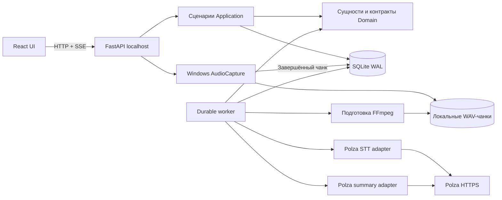

# Архитектура Secretary V1

## Контракт и решения

Заказчик и оператор — один пользователь Windows. Вход: локальная аудио/видеозапись либо явно включённые микрофон/WASAPI loopback. Выход: локально сохранённое аудио, версия исходной расшифровки, отдельно читаемый текст, краткий итог, решения, задачи и вопросы с исходными ссылками, экспорт и сведения о расходах. При отсутствии ключа либо облачном отказе аудио должно сохраниться, а UI обязан показывать реальное незавершённое состояние.

**ADR-001:** модульный монолит React/TypeScript/Vite + Python 3.12/FastAPI/Pydantic + SQLite WAL и файлы. Один локальный worker без Redis/Celery. Для одного пользователя это упрощает восстановление, Windows-установку и тестирование. PostgreSQL/распределённый worker появляются только при реальной многопользовательской нагрузке через repository interfaces.

**ADR-002:** отдельный PyAudioWPatch capture adapter вместо переноса Rust/Tauri приложения целиком. Аудит выявил неактивный Meetily audio_v2, unsupported native Windows system capture в Minutes и отсутствие поддержки Windows в meetscribe. Каналы микрофона и системы хранятся независимо; канал не означает человека. Нативные библиотеки изолированы в `.venv`.

**ADR-003:** httpx по настоящему HTTP-контракту Polza; STT JSON/data URL. OpenAI SDK не используется. Версии моделей выбираются конфигурацией и публичным каталогом; качество модели не считается доказанным по цене/каталогу. Default turbo + small Qwen выбран для первоначального ограниченного benchmark, не как квалифицированный победитель.

**ADR-004:** собственные SQLite задания/атомарный захват/уникальные ключи, этапные результаты и чеки запросов. Exactly-once гарантируется только для локальных записей в пределах уникальных ограничений; внешняя сеть может иметь неопределённый результат. Неоднозначные оплачиваемые попытки требуют сверки, а async provider job ID сохраняется и опрашивается без повторной отправки.

## Границы

Domain: Meeting, AudioChunk, TranscriptSegment, Speaker, Summary, ActionItem, ProcessingJob, UsageRecord и typed repository/provider interfaces. Application: этапы подготовки, транскрибации и итогов, ссылки на источники, допустимые переходы и бюджеты. Infrastructure: SQLite migrations/repositories, FFmpeg/files, Windows audio, httpx/Polza/catalog. Orchestration: фоновый worker и восстановление. Interface: `/api/v1`, OpenAPI/SSE и React. Доменные модели не импортируют React или SDK конкретной модели.

Stable UUIDs, UTC событий, миллисекунды относительно записи. Confidence — nullable 0..1, точность времени явная (`word`/`segment`/`chunk`/`unknown`). Границы чанка показываются как приблизительные; нулевые таймкоды не подставляются. Speaker labels имеют scope чанка; реальное имя задаётся отдельно и не угадывается по каналу. Итог привязан к transcript_version, readable_transcript не перезаписывает raw segment text.

## Устойчивость и ресурсы

Запись сбрасывает завершённые WAV на диск независимо от сети. Очереди захвата ограничены, cloud worker контролирует параллельность, импорт читается потоком. Для большой записи FFmpeg создаёт ограниченные по длительности файлы, а не единый объект в Python RAM. Повторная обработка пропускает завершённые чанки и заменяет результаты атомарно. После перезапуска незавершённые операции проверяются; async Polza receipt продолжает polling, неоднозначный sync timeout не превращается в автоматическое повторное списание.

Стадии и количество готовых элементов берутся из БД. При неизвестном объёме UI показывает стадию. Отмена прекращает новые запросы и сохраняет полученные результаты и аудио; уже принятый провайдером запрос может завершиться и остаться оплачиваемым. Повтор выбранного этапа сохраняет provenance и версии. При новом live-чанке старый итог не является итогом всей растущей встречи.

Длительные итоги обрабатываются ограниченными группами сегментов с финальным объединением; source IDs проходят проверку принадлежности расшифровке. Содержимое встреч передаётся как недоверенные данные: оно не меняет системные инструкции и не запускает инструменты. Структурные проверки не доказывают смысловую достоверность решения — её подтверждает benchmark на эталоне.

Оценка, подтверждённый расход и неизвестный расход хранятся раздельно. Дополнительные финансовые ограничения управляются текущим глобальным `local_cost_limits_enabled`, который не входит в снимок маршрута задания. При `true` reservation учитывает бюджет, незавершённые запросы и неизвестную цену; при `false` журнал сохраняется без этих ограничений, а Polza-запросы не содержат `provider.max_price`. Неопределённый receipt нельзя обнулить независимо от флага. HTTP 401/402/413/429/5xx/timeout имеют разные состояния и ограниченную политику повтора.

## Безопасность и сопровождение

Только 127.0.0.1, Host/Origin allowlist, CSRF token для mutations. API никогда не отдаёт Polza key; `.env` не входит в Git, localStorage и frontend bundle. Локальные пути из БД не принимаются как произвольные клиентские пути; файлы принадлежат meeting storage. Ограничены upload/body sizes и длительность subprocess. Внешние URL для пользовательского аудио не принимаются, чтобы не добавлять SSRF.

SQLite/FastAPI single-process рассчитаны на одного пользователя, не на несколько параллельных серверов с общей capture state. Экспорт и данные остаются локальными. Логи не содержат ключей, cloud payloads и личных транскриптов. No secrets/test personal audio. Наблюдаемость: job transitions/errors, receipts/usage, SSE snapshots, файлы журнала собственного launcher, doctor. Скрипты проверяют PID+creation time+launcher; порт чужого процесса не освобождается.

Плеер использует неизменяемые WAV snapshots выбранного канала: hash состава чанков, channel lock, уникальный temporary file и атомарная публикация без замены открытого Windows-файла. Сохраняются offsets/разрывы, copy buffer ограничен. Старые playback snapshots сохраняются для активных readers; автоматический eviction ещё не реализован, возможен существенный рост диска при воспроизведении растущей длинной встречи. Native masters не удаляются.

Оставшиеся риски: реальное качество русского STT и смысловая достоверность LLM, возможности конкретного Polza-аккаунта, неопределённость sync оплаты после сетевого сбоя, реальные драйверы/микрофон/loopback и очередь Aiesa. Их квалификация требует ключа, эталонной записи или действий оператора; публичная metadata и тестовые transport ответы её не заменяют.
