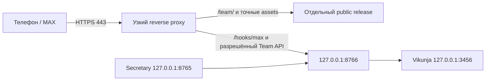

# T11: выбор внешнего HTTPS для существующего Windows-хоста

Дата: **2026-10-04**. Подготовка read-only и проектных файлов не меняла DNS, NAT, firewall, маршруты/VPN, сертификаты, accounts или автозапуск. Публичная доступность хоста **UNKNOWN**; сеть до внешнего подтверждения — **BLOCKED** для production MAX.

## Маршрут и границы



На роутере/хосте наружу не открывать `3456`, `8765`, `8766` или raw Uvicorn. `127.0.0.1` успешен только на этом компьютере. Private/CGNAT IPv4, маршрут VPN и локальный HTTPS fixture не доказывают доступ с телефона через мобильную сеть. MAX требует внешний HTTPS endpoint на 443, а не произвольный публичный порт. [Требования Webhook](https://dev.max.ru/docs-api/methods/POST/subscriptions).

| Вариант | Когда подходит | Что остаётся проверить / утвердить |
|---|---|---|
| Собственный ПК + публичный доступный WAN + домен | Провайдер допускает входящий 443, владелец управляет NAT/firewall, ПК работает 24/7 | Реальный WAN/CGNAT, договорённость о стабильности адреса, точный A/AAAA, forwarding только 443, TLS chain, внешняя проба |
| Уже имеющийся доверенный ingress/relay | Прямого WAN нет, но владелец уже располагает маршрутом с доменом и HTTPS | End-to-end Host/TLS/secret, allowlist paths, доступность, стоимость и ответственность; relay не получает доступ к local Secretary |
| Прямой адрес недоступен; нового ingress нет | CGNAT/нет прав/порт блокирован/нет домена | Production network **BLOCKED**; offline развитие и локальные проверки продолжаются. Покупка домена/IP/VPS — отдельное решение владельца |

Статический доступный WAN предпочтителен для выбранного пилота, но само слово «статический» не подтверждает открытый 443. Динамический адрес требует отдельно выбранного поддерживаемого DNS/операционного процесса; такого процесса пакет не обещает. Случайный бесплатный tunnel не объявляется гарантированным 24/7 решением. Дополнительные покупки/подписки не выполняются автоматически.

## Что выясняет владелец до изменения сети

1. У провайдера: является ли WAN публичным, используется ли CGNAT, разрешён ли inbound 443, меняется ли адрес и какие услуги уже доступны. В локальном интерфейсе роутера сверить WAN с наблюдением из другой сети. `100.64.0.0/10` — shared space для CGN; обнаружение такого WAN является сигналом для проверки, а не полным доказательством конкретной топологии. [RFC 6598](https://datatracker.ietf.org/doc/html/rfc6598).
2. Установить, кто вправе менять роутер/firewall, и проверить текущий маршрут с учётом уже работающего VPN, не переключая его ради предположения. Зафиксировать только capability/result, не пароль роутера или чувствительную полную конфигурацию.
3. Выбрать имеющийся домен и управляемую DNS zone. Проверить A/AAAA и доступность всех опубликованных адресов; рабочий IPv4 не оправдывает сломанный AAAA. Подготовить TLS с полной доверенной цепочкой для того же имени.
4. Согласовать последствия: один публичный listener 443, узкие routes, выбранные certificate issuance/renewal и proxy account, target только loopback Gateway. Проверка из другой сети выполняется после конкретного разрешённого подключения. До этого не создавать subscriptions MAX.

## Подготовленный deploy diff

| Артефакт / настройка | Подготовка в проекте | Внешний шаг владельца |
|---|---|---|
| `config/team/Caddyfile.example` | Точный public Host, allowlist методов/path, deny остальных paths, loopback upstream | Выбрать Host и активировать проверенную копию после review |
| `config/team/deployment-manifest.json` | Закреплённые компоненты, routes и public/private границы | Проверить согласованный instance и account |
| `scripts/team/prepare_public_assets.py` | Отдельный `.runtime/team/public/releases/<id>` с выбранным Team HTML/assets, private deploy manifest и `asset-routes.caddy` | Использовать только подготовленный immutable release; не указывать project/data/dist root как public directory |
| `TEAM_PUBLIC_HOST`, `TEAM_PUBLIC_ROOT`, `TEAM_ASSET_ROUTES`, `TEAM_CADDY_DATA` | Параметры proxy package; значения ещё не настроены этой карточкой | Подставить подтверждённый Host, выбранный release path, точный routes fragment и private project-local каталог сертификатов локально |
| `TEAM_PUBLIC_ORIGIN` | Тот же exact HTTPS origin на Gateway | Согласовать с Host/cookie/origin checks; не доверять произвольному forwarded Host |
| DNS/NAT/firewall/TLS | Только конкретная инструкция/diff, без активации | Выполнить одобренные изменения, проверить внешнюю 443/TLS и откат |

Из корня проекта сначала выполнить локальную build; продолжать только при её exit 0:

```powershell
Push-Location .\frontend
npm.cmd run build
Pop-Location
```

Точный локальный CLI для нового release после актуальной frontend build с `.vite/manifest.json`:

```powershell
& .\.venv\Scripts\python.exe -B .\scripts\team\prepare_public_assets.py --dist .\frontend\dist --output .\.runtime\team\public\releases\RELEASE-ID
```

`RELEASE-ID` заменить новым локальным именем; существующий destination не перезаписывается. Скрипт выбирает transitive assets от `team.html` по Vite manifest, допускает нужный shared runtime и исключает отдельные private entry outputs. Каталог release непосредственно задаёт `TEAM_PUBLIC_ROOT`; `TEAM_ASSET_ROUTES` указывает на его `asset-routes.caddy`. `deploy-manifest.json` и routes fragment физически находятся в release, но не входят в HTTP allowlist. `prepared_not_activated` — результат локальной подготовки, а не публикация или network PASS; эту команду автор документа не запускал.

Публичный package не должен включать главный Secretary HTML, `/assets` всего приложения, `/team/team.html`, `.env`, исходники, SQLite/WAL, logs, raw audio/voiceprints, `/internal`, `/session` local API, `/config`, capture/enrollments или весь `/api/v1`. Team API имеет отдельные session/CSRF/ACL; webhook имеет отдельный секрет. Proxy сохраняет согласованный Host, forwarding доверяется только собственному loopback proxy по контракту runtime.

Версию project-local Caddy и происхождение архива закрепляет deploy manifest и проверка установки; этот документ не предписывает `latest`, глобальную установку, смену PATH или отключение TLS. Не ослаблять общий системный trust store. Если реальный MAX TLS требует дополнительный подтверждённый CA, подготовить проверенный project-local CA bundle и отдельное решение владельца.

Подготовленный template использует ACME TLS-ALPN-01 на 443, отключает HTTP challenge и автоматический HTTP redirect; открытие 80 не входит в согласованный diff. `TEAM_CADDY_DATA` хранит certificate/account state вне public release и доступен только runtime account. Выпуск/renewal настоящего сертификата этим документом не выполнялся; его работа зависит от подтверждённых DNS и внешнего 443.

## Read-only ingress check

Согласованный контракт CLI из `D:\AI\Projects\Active\Secretary` имеет точные аргументы; реализацию и evidence проверяет отдельный владелец ingress:

```powershell
powershell.exe -NoProfile -ExecutionPolicy Bypass -File .\scripts\team\check_ingress.ps1 -ReadOnly
```

Без `-PublicUrl` он выполняет **ноль DNS/network probes** и возвращает `configuration_required`. В текущей T11 допустима только эта форма; это проверка интерфейса инструмента, а не доступности интернета хоста.

После отдельного разрешённого подключения и выбора реального URL владелец может выполнить:

```powershell
powershell.exe -NoProfile -ExecutionPolicy Bypass -File .\scripts\team\check_ingress.ps1 -ReadOnly -PublicUrl 'https://CONFIRMED-HOST/team/'
```

`CONFIRMED-HOST` — placeholder, заменить локально; команда с ним здесь не запускалась. Разрешён только ASCII HTTPS URL на 443 без credentials/query/fragment/percent/backslash/dot segments/control. Инструмент проверяет публичный DNS/IP, один pinned TCP/TLS маршрут и один HEAD по точному path, не следует redirect, не отправляет auth, не читает body и не использует произвольный proxy. Private/localhost/mixed addresses не соединяются.

Результат — JSON в stdout, без `-OutputPath`: `schema_version`, `observed_at`, `read_only`, `vantage=current_host`, `status`, нормализованный `target`, `error_code`, отдельные `dns`, `tcp443`, `tls`, `http`. Отсутствие `-ReadOnly` и недопустимый input дают exit 2. Сформированный capability report, включая неуспешную network-проверку, даёт exit 0: **exit 0 не равен network PASS**, проверять `status` и поля.

Наблюдение с этого же Windows-хоста не меняет `external_reachability`, `cgnat`, `static_wan_ip`, `nat_permissions`, `mobile_network` или `max_callback`: они остаются unknown. Даже valid TLS + HTTP 200 может быть hairpin/локальным маршрутом. Если HEAD получил 401/403/503, сохранить фактический ответ и выяснить его причину, не заменять успехом. Redirect также не является PASS целевого endpoint.

## Активация и проверка из другой сети

До активации собрать reviewable пакет: конкретный Host/origin, public release hashes, narrow route diff, pinned proxy runtime, plan DNS/NAT/firewall/TLS, секреты только в локальном runtime, maintenance/rollback procedure. Одобрение владельца относится к этому конкретному пакету, а не к любому будущему изменению сети.

После подключения проверить с мобильной сети с отключённым Wi-Fi: открытие `/team/`, полную TLS chain, отказ запрещённым paths и валидный вход MAX. Затем зарегистрировать только собственную webhook subscription и проверить реальное сообщение → durable event → ответ. `GET /subscriptions` и local HEAD сами по себе callback не доказывают. Раздельно проверить native voice и audio file; успешный файл не квалифицирует voice transport.

Production MAX допускает только Webhook. Long Polling — **DEV_ONLY** и не включается одновременно с подпиской. [События MAX](https://dev.max.ru/help/events). При отсутствии внешнего HTTPS не обещать production через polling.

Откат выполняется только для своего согласованного instance: прекратить новые внешние операции/подписку по owner procedure, вернуть выбранный private configuration и ранее согласованные DNS/NAT/firewall изменения, сохранив durable uncertain receipts. Не удалять чужие subscriptions, не сбрасывать router/VPN и не завершать чужие процессы. Сценарии owner-safe запуска/остановки, автостарта, backup/restore и проверки 24h относятся к T12/T13.

Три первоначальных партнёра и будущие участники до десяти используют этот один Gateway и явные права. Не обещается произвольный multi-tenant масштаб. Работоспособность 24/7 проверяется наблюдением после reboot/reconnect, current sync/notification health и реальной доставкой на телефоны; зелёный local health, tests или эмуляция viewport не дают этого статуса.
