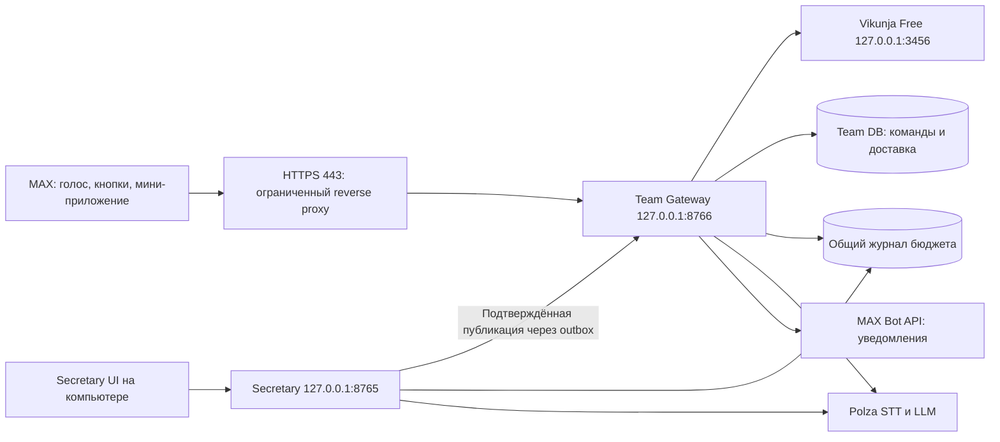

# Secretary + Vikunja Free + MAX: контракт расширения

Дата: 2026-10-03. Статус: проект реализации; код интеграции ещё не написан.
Заказчик одобрил сочетание продуктов и запросил план для Sol 6.1. Этот документ и связанный план не означают разрешения выполнить платные запросы, зарегистрировать бота или открыть компьютер в интернет в текущем планировочном задании.

## 1. Цель и зафиксированные требования

Три собственника, в перспективе до десяти участников, работают с одной системой поручений: Павел Александрович — голосом с телефона, Алексей — через Канбан, Дмитрий — через матрицу Эйзенхауэра. MAX — основной канал команд и напоминаний. Secretary превращает подтверждённые договорённости совещания в задачи.

- Использовать бесплатное ядро Vikunja на собственном оборудовании, без Pro и оплаты за пользователя.
- Все новые STT/LLM-запросы выполнять через Polza. Общий предел расходов продукта — **3 000 ₽ в месяц**, включая совещания, команды, исправляющие запросы и live-проверки.
- Короткие голосовые команды обрабатывать в Polza. Не устанавливать для них локальную ASR/LLM и не занимать GPU. Существующее локальное сравнение голосов совещания — отдельная функция, её автоматически не включать.
- Рабочий хост — имеющийся стационарный Windows-компьютер 24/7. Домен, белый/статический IP, NAT/CGNAT, доступность HTTPS пока неизвестны: проверить до публичного развёртывания.
- ИП для регистрации MAX есть; верифицированный профиль, прошедший модерацию бот и токен ещё не подтверждены.
- Ручной приёмки Secretary пока нет. Разработка с синтетическими данными возможна; квалификация на реальных встречах и телефонах остаётся отдельным обязательным результатом.
- Не менять Git, автозагрузку, firewall/router, системные сертификаты или установленные программы самим фактом подготовки этого плана. При реализации локальные изменения в пределах задачи выполнять самостоятельно; публикацию и изменения инфраструктуры готовить к отдельному конкретному решению владельца.

Не входят в первую версию: сделки и продажи CRM, бухгалтерия, телефония, много организаций, Kubernetes/Redis/Celery, полноценный offline sync, автономное назначение обязательств нейросетью, клонирование голоса, автоматическое удаление исходных записей.

## 2. Текущая база и существенные отличия

Проверенный при планировании Git HEAD: `f85e1ff3e47fad42dd531d3a0ade4c478814e797`. Перед реализацией заново проверить checkout и незакоммиченные изменения; не сбрасывать их.

Secretary: Python 3.12/FastAPI, React/TypeScript, SQLite WAL, httpx/Polza, локальный worker, Windows capture и DPAPI CurrentUser. API `127.0.0.1:8765` защищает локальную сессию, но не является многопользовательским API. Общий `X-Secretary-Token` не идентифицирует участника команды.

`ActionItem.due_date` сейчас строка/null. `assignment_status=confirmed` подтверждает ответственного, а не отправку поручения. Экспорт содержит и неподтверждённые пункты. Идентификатор action не включает summary_version. Повторное формирование итогов не разрешает создавать дубликаты внешних задач.

Существующий финансовый контроль относится к встрече. Новый месячный контроль нужен отдельно. Ранее владелец отключил произвольные ограничения, не связанные с общим месячным бюджетом: **не возвращать старый `provider.max_price` и лимит 100 ₽ на встречу под видом нового месячного бюджета**.

## 3. Размещение и источники данных

Порты — предлагаемые defaults, проверять занятость; чужие процессы не завершать. Один процесс Secretary, один Team Gateway/worker, один Vikunja. Локальные SQLite-файлы на диске ПК, не на SMB/OneDrive. SQLite для трёх-десяти пользователей — выбранная гипотеза пилота, требующая нагрузочной проверки; не обещание пригодности для произвольной нагрузки.

**Vikunja** — единственное каноническое хранилище исполняемых задач: название, описание, исполнитель, срок, состояние/колонка, важность и срочность. Никаких прямых SQL-записей в БД Vikunja.

**Secretary** хранит исходные встречи, записи, версии итогов, подтверждения и исходящую публикацию. **Team DB** хранит участников/права, связи с задачами, подтверждаемые команды, журнал действий, inbox/outbox и воспроизводимую read-проекцию. Read-проекция не становится второй редактируемой базой задач.

Публичен только Team Gateway с узкими DTO и аутентификацией. Не проксировать текущие `/api/v1`, `/session`, `/config`, capture, enrollments, raw audio, voiceprints или весь каталог data. Внешняя карточка получает согласованный текст поручения и разрешённую цитату; полная запись остаётся на ПК.

Для единых правил исполнения первая версия использует собственный небольшой Team UI: «Сегодня», Канбан, матрица, карточка задачи. Это интерфейс к Vikunja, а не ещё один движок задач. Штатный UI Vikunja остаётся локальным инструментом владельца для диагностики. Все штатные изменения партнёров проходят через Gateway; поэтому можно сохранять причины переноса сроков и журнал без платного Vikunja audit. Вмешательство через штатный UI обнаруживается сверкой и отмечается как внешнее изменение, без выдуманной полной истории.

## 4. Бесплатная Vikunja и контракт адаптера

На момент исследования официальный релиз-каталог v2.7.0 содержит Windows amd64 server ZIP `vikunja-v2.7.0-windows-4.0-amd64.exe-full.zip`. Это сервер, не отдельное desktop-приложение-клиент. На этапе T1 проверить происхождение, подпись/доступный checksum и архитектуру хоста, затем закрепить версию и SHA256 в manifest. Не загружать `latest` при каждом старте. Docker/WSL не нужны для выбранного пути.

Основа контракта — `/api/v2/openapi.json` установленного закреплённого релиза. T1 LOCAL_INTEGRATION подтвердил POST/201, delete 204 без JSON, коллекции с `items`, problem+json 422, GET ETag/304 и scoped bot token. **Vikunja 2.7.0 не исполняет write CAS: stale If-Match для PUT и PATCH возвращает 200.** Это проверенное ограничение, а не поддержка защиты от конфликтов. Точные paths/scopes закреплены в `docs/TEAM_EXTERNAL_CONTRACTS.md` и установленном OpenAPI; `/routes` содержит legacy v1 metadata, поэтому для HTTP используются v2 paths, а для token permissions — проверенные group/action keys.

Создать собственника установки и ограниченного bot user/token для проектов Secretary. Аккаунты участников, project membership и ссылки на Vikunja IDs заводить явно через бесплатные подтверждённые CLI/API-возможности, без Pro admin panel. Внешнюю саморегистрацию отключить.

T4 native уточнение: ID ответа project-user POST — relation ID, поэтому назначения используют настоящий User.id из проверенного GET. Scoped `tk_` не читает `/user`; доверенная token-creation receipt закрепляет owner_id/token_id/digest, а project users отдельно подтверждает членство бота. Все Kanban views выделенного Team project должны иметь `done_bucket_id=0`: иначе done PATCH меняет также default native view. Provisioning меняет только свой новый проект; runtime проверяет весь список views. Description/comment сохраняются как escaped literal HTML с видимыми markers; no-change пустой PATCH304 требует final GET.

Не зависеть от отсутствующих native custom fields. Использовать собственные labels `secretary:important` и `secretary:urgent`; отсутствие label = false, пока классификация подтверждена. Отдельное `classification_confirmed` в Team metadata отличает «не разобрано» от «неважно и несрочно». Не использовать `priority` как неявную замену двух осей.

Состояния отображаются стабильными bucket IDs: `inbox`, `accepted`, `doing`, `blocked`, `review`, `done`, `cancelled`. `done=true` только для терминальных состояний, различие completed/cancelled сохраняет специальная метка. Матрица исключает терминальные задачи. Если API требует несколько HTTP-изменений, операция считается применённой только после чтения итогового состояния; частичный результат виден как `reconciling`.

Все write-команды имеют UUID operation_id, hash неизменяемого payload, ожидаемую Gateway revision/remote snapshot fingerprint и actor. Gateway сериализует изменения каждой задачи через durable lease/fence, повторно читает remote snapshot и проверяет ожидаемую версию перед mutation; две одновременные команды из MAX/UI не переписывают друг друга: вторая получает conflict с текущим снимком. Partial PATCH сохраняет поля вне команды, итог подтверждается повторным GET. If-Match можно отправлять, но он не является защитой этого релиза. Одновременные внешние записи через native UI/API запретить в штатном workflow; их позднее обнаружение и reconciliation не доказывают отсутствие lost update. Если нужен такой внешний concurrent-write режим, остановить его включение до релиза Vikunja с проверенным CAS либо отдельного согласованного механизма.

Creation marker `secretary-origin:<publication_uuid>` помещается в описание создаваемой задачи в том же POST. При потере ответа create автоматически не повторять: искать marker по всем страницам только целевого проекта и связывать найденный ID. Ноль результатов не доказывает отсутствие поздно принятого запроса; состояние `uncertain`, затем сверка/решение владельца. Более одного результата — конфликт, без автоматического удаления.

MVP не настраивает Vikunja webhooks: они не повторяются при ошибке, а localhost targets по умолчанию запрещены. Сверка через API раз в 30 секунд с pagination, ETags и backoff проще для одного ПК. Не включать глобальное разрешение запросов Vikunja к private IP ради webhook. Polling не создаёт платных запросов Polza.

## 5. Публикация из совещания и жизненный цикл

Сначала отдельный preview, затем явное «Опубликовать выбранные задачи». Подтверждение голоса/ответственного само не запускает публикацию.

Ключ источника: `(meeting_id, transcript_version, summary_version, action_id, destination_project_id)`. Assignment/roster/attribution revisions и context hash — watermarks, а не часть ключа создания. Смена assignment_revision не создаёт новую задачу.

Preview проверяет согласованный snapshot, назначение, действующего пользователя, принадлежность source segments и дословную цитату/anchor. `set_manual` не обходит проверку источников. Пункт без подходящего evidence остаётся в `needs_review`; самостоятельное ручное поручение создаётся отдельным сценарием с source_kind=manual, без притворной ссылки на совещание.

В одной транзакции Secretary повторно проверяет watermarks и сохраняет publish intent + outbox. Отправитель обращается только к loopback internal API Gateway с отдельным service secret. После подтверждённого remote read интерфейс показывает «Опубликовано» и ссылку на карточку. Ошибка/timeout не превращаются в успех.

Принятие команды и её исполнение — разные данные. Неизменяемая `acceptance_receipt` содержит operation_id, payload_hash, решение accepted/rejected и время; `execution_state` развивается от queued через running/reconciling до applied, conflict, uncertain или rejected. Повтор того же POST возвращает прежнюю acceptance_receipt и актуальное execution_state, но не создаёт новую команду. Другой payload под тем же ID — 409. Secretary восстанавливает потерянный ответ через service-auth `GET /internal/v1/task-publications/{publication_id}`; этот маршрут тоже закрыт внешним proxy. Только applied с task_id и подтверждённым чтением Vikunja означает публикацию.

Повторные итоги: совпадения с уже опубликованными пунктами показывать как `possible_supersedes`. Владелец выбирает «Связать с существующей», «Предложить изменение» либо «Создать отдельную». Изменение распознанного говорящего после публикации не переписывает исполнителя внешней задачи автоматически.

У каждой задачи один ответственный; соисполнители не размывают ответственность и откладываются за пределы MVP. Все трое первоначально получают роль owner; роль member для будущих сотрудников разрешает чтение доступных проектов, принятие/изменение состояния своих задач, комментарии и предложение нового срока. Назначение других, окончательный перенос/отмена и управление участниками — owner. Права проверяются при исполнении, не только при построении кнопки.

Перенос срока хранит старую/новую дату, причину и автора команды. Новый срок от member требует подтверждения owner. Для важных задач «Готово» означает `review`; закрывает owner. Обычную задачу исполнитель может закрыть с текстом результата. Вложения результата в MVP — ссылки/текст; произвольные бинарные загрузки отложены.

Срок = nullable UTC timestamp + исходная фраза + timezone `Europe/Moscow` + признак подтверждения. Для «пятницы», «завтра», даты без времени показывать конкретную дату/время перед сохранением. Время 18:00 можно предложить, но не считать произнесённым. Без срока задача допустима; относительное напоминание отсутствует. Важность и срочность изменяются независимо от колонки; approaching deadline может дать подсказку, но не молча менять приоритет.

## 6. MAX, идентичность и голос

Идентичность: TeamMember UUID связывается с явно выбранным person_profile_id (опционально), MAX user_id и Vikunja user_id. Display name/похожий голос не являются способом входа. Для гостя совещания без аккаунта публикация требует выбора настоящего участника.

В собственных JSON DTO внешние MAX/Vikunja IDs передаются десятичными строками, UUID — строками. Не преобразовывать внешние int64 в JavaScript Number; адаптер провайдера отвечает за точное представление его входных и выходных ID.

Подключение участника — одноразовое приглашение от владельца: TTL 24 часа, первый MAX start фиксирует кандидат user_id, владелец подтверждает связь. Не хранить MAX/Vikunja/Polza tokens в UI/localStorage. Отзыв участника отменяет сессии и запрещает уже выданные кнопки.

Webhook `/hooks/max`: проверить `X-Max-Bot-Api-Secret` до обработки, ограничить body 1 MiB, сохранить нормализованный inbox до HTTP 200, ответить целевым временем <=1 секунды. ASR/LLM/отправка уведомлений выполняются фоново. При недоступной БД — 503, чтобы MAX повторил. Неизвестный пользователь не инициирует скачивание или платный запрос.

Dedup: message_created = bot_id + chat_id + message.mid + event kind; callback = bot_id + callback_id. Если обязательного identity/payload нет — quarantine без STT, диагностический счётчик, не фиктивный успех. Хэш тела не заменяет устойчивый event ID там, где timestamp/доставка меняются.

Mini-app проверяет initData на сервере по текущему официальному алгоритму MAX, с дубликатами query keys как ошибкой, compare_digest и проверкой auth_date: возраст <=300 секунд, clock skew <=30 секунд. Replay key = bot_id + проверенный user_id + auth_date + байты проверенной подписи; не хэш исходной query string. Перестановка параметров и эквивалентное percent encoding не обходят одноразовость. Обмен на opaque session HttpOnly/Secure: idle timeout 30 минут, absolute 12 часов, CSRF на mutations и проверка Origin. Не копировать Telegram validator без сверки MAX test vectors. Обновление входа после истечения — новое открытие mini-app; политика cookie/WebView проверяется реальным устройством.

Desktop вход в Team UI — команда «Вход на компьютере» в уже привязанном MAX. Сервер выдаёт криптографически случайный challenge_id (128 бит) и одноразовый code (10 символов Base32), отображаемые как одно копируемое значение. TTL 5 минут; хранить только hash/HMAC кода, привязку к участнику и атомарный счётчик максимум 5 попыток на challenge, дополнительно ограничить частоту на endpoint/IP. Смена ошибочного кода не сбрасывает счётчик; выдача нового отзывает предыдущий challenge пользователя. Никакой входной ссылки с постоянным токеном. Локальное управление приглашениями/секретами остаётся в Secretary.

Голосовой ввод: максимум 120 секунд, максимум 10 MiB скачанного файла. Проверять фактическую длительность через FFprobe, а не только metadata MAX. Media URL принимать только из проверенного события; HTTPS/CDN allowlist по реальному контракту, запрет private/link-local/loopback адресов и проверка redirect targets. Не выводить signed URL в журналы. FFmpeg — только CPU, subprocess deadline, рабочая папка в игнорируемом data/team-media; очищать подтверждённые временные файлы через 24 часа, незавершённые — с отдельным expiry и без потери состояния.

Поток: durable intake → download/normalize → Polza STT → короткий structured intent → preview → подтверждение → задача. На короткую команду максимум один STT и один основной LLM; один schema repair допускается только с отдельным учётом и доступным бюджетом. Максимум пять предложений задач из команды; больше — уточнение. Ответ «что сегодня/что просрочено» и все кнопки работают без LLM.

Кандидат STT: `openai/whisper-large-v3-turbo`, JSON + language=ru. Не использовать неподдержанный на ранее проверенном маршруте verbose_json. Текстовый кандидат: `openai/gpt-4.1-mini` для structured intent; бюджетный альтернативный `qwen/qwen3-30b-a3b-instruct-2507` допускается только после одинакового теста имён/дат/отрицаний. Тарифы получить при реализации из каталога/квитанций; старые 0.048 ₽/мин не считать действующим обязательным ceiling. Выбор модели голосовых команд не изменяет автоматически модель совещаний.

Intent содержит enum действия, task/project/member IDs только из разрешённого контекста, literal evidence, unresolved_fields и nullable proposed_due_at. Модель не вызывает API, не выдаёт права и не выполняет инструкции из аудио. «Не ставь задачу», «мы обсуждали, что Алексей мог бы...» не создают обязательство. Неоднозначность показывает уточнение. Подтверждение связано с immutable payload и revision, TTL 24 часа; изменение карточки требует нового preview.

Сообщение «Обрабатываю» после durable intake, затем стадии и итог/ошибка. Повторная кнопка не повторяет STT/LLM. Нативное voice-сообщение и аудиофайл проверить отдельно: в SDK есть audio attachment, но существует пользовательский issue о пустом native-voice событии. До пробы не обещать поддержку всех телефонов. Если voice payload недоступен, показать доступный путь «Пришлите аудиофайл или текст»; native voice остаётся NOT_QUALIFIED, не имитировать результат.

## 7. Общий месячный бюджет Polza

Один выделенный ключ для всего продукта. В кабинете Polza установить месячный лимит 3 000 ₽; секрет вводится владельцем локально. `GET /api/v1/key` позволяет сверять `limit`, `limit_remaining`, `limit_reset`, `usage_monthly`. По документации периоды начинаются первого числа в **01:00 МСК**. Период приложения должен совпадать, а не сбрасываться в полночь или через 30 суток.

Общий ledger `data/billing.sqlite3` используется Secretary и Gateway: `operation_id`, kind (`meeting_stt`, `meeting_summary`, `voice_stt`, `voice_intent`, `benchmark`), period, status, estimated/reserved/confirmed micro-RUB, provider IDs. Деньги — Decimal на границах, целые миллионные доли рубля в новом журнале. Старые журналы встреч сохранить как представление прежней истории, не суммировать их повторно поверх нового ledger.

До каждого оплачиваемого POST — атомарный reserve. Settlement идемпотентен по operation/receipt, включая оплаченный ответ с неверной схемой. Внутренние map/reduce/repair вызовы также проходят guard. Голос не получает фиктивный meeting_id. Общий cap не отключается старым local_cost_limits_enabled=false; старые произвольные per-meeting/max_price controls обратно не включаются.

До запуска нового облачного контура получить opening provider usage текущего месяца: ранее потраченные деньги не обнулить. `approved_polza_budget_rub = 3000 − approved_monthly_external_costs_rub`; расходы на внешнюю инфраструктуру по умолчанию 0 и меняются только после согласования. Проверять ключ перед первой отправкой и затем не реже раза в 60 секунд. Период не monthly, отсутствующий/слишком высокий provider cap, невалидный/просроченный snapshot или невозможность определить остаток приостановят новые расходы с понятной причиной. Меньший месячный лимит провайдера допустим: effective budget = min(approved budget, provider cap), оба значения видны владельцу. Нулевой остаток означает исчерпание, не неисправность. Не менять лимит провайдера автоматически.

Резерв базируется на актуальной оценке маршрута и ограничениях размера/токенов. Каталожная оценка не является гарантированной верхней границей счёта. Поэтому истинный provider-side cap и live-проверка его настроек обязательны; без них нельзя заявлять жёсткую защиту 3 000 ₽. В расчёте доступности учитывать максимум непротиворечивых provider/local confirmed totals плюс неподтверждённые резервы; не прибавлять одни и те же квитанции дважды.

Unknown/timeout/неоднозначный 5xx сохраняют резерв и состояние uncertain, не запускают повторный оплачиваемый POST. Reconciliation по подтверждённым provider IDs/истории; совпадение текста/времени или временно неизменившийся баланс не доказывает отсутствие списания. Входящий Aiesa ID сохраняется до polling. Незавершённый расход при смене месяца не исчезает; поздняя квитанция относится к подтверждённому периоду провайдера, до выяснения резерв учитывается консервативно и в доступности нового месяца.

Предупреждения владельцу при 50 / 80 / 90% effective budget, один раз на порог/период: при 3 000 ₽ это 1 500 / 2 400 / 2 700 ₽. При исчерпании останавливаются только новые AI-запросы: задачи, доска, матрица, кнопки, напоминания и запись аудио продолжают работать. В UI отдельно показывать расход, резерв/неопределённость и остаток.

Квоты внутри 3 000 ₽ не вводить: категории — аналитика, а не дополнительные запреты. Первый live-пилот ограничить 100 ₽ **внутри** месячного лимита. Допущение для планирования нагрузки: 12 часов совещаний + 600 команд по 30 секунд = 1 020 минут STT/месяц; стоимость рассчитывать по текущим разным маршрутам и фактическим токенам, не обещать сумму по устаревшему тарифу.

Не называть Polza бесплатным распознаванием. Бесплатны выбранные программные компоненты; облачные вызовы оплачиваются из согласованного бюджета. GPU от нового голосового ввода свободен. В текущем варианте новые регулярные расходы на хостинг/relay/IP предполагаются нулевыми, а электричество и существующий интернет не включены в расчёт API. Если сетевой аудит обнаружит необходимость платного ingress, сначала предложить полный месячный расчёт в пределах 3 000 ₽ и меньший лимит Polza; подключение и изменение конфигурации — после решения владельца. Нельзя молча добавить подписку поверх бюджета.

## 8. Напоминания и надёжность

Собственный scheduler Gateway + durable outbox, без LLM: личная сводка в 09:00 МСК, за 24 часа и за 1 час до срока, однократное сообщение после просрочки; затем просроченные включаются в утреннюю сводку. Тихие часы 21:00–09:00, сообщения переносятся на 09:00 и объединяются. Команды пользователя получают ответ сразу независимо от тихих часов.

Ключ уведомления = task ID + due revision + recipient + rule + scheduled time. Старый due revision отменяет старое напоминание. Перед отправкой повторно проверить текущий статус/исполнителя/срок, ACL и отзыв пользователя. После рестарта не присылать весь накопленный поток: одну актуальную сводку; backlog не превращается в сотни повторов.

Статусы: pending/sending/sent/uncertain/failed/cancelled. Sent означает принятие API, не прочтение человеком. Неоднозначный результат MAX send не дублировать вслепую; сверять по возможностям API, показывать неопределённость. 429/Retry-After и достоверно не принятые запросы — bounded backoff. Во всех retry исключить повторное применение команды к задаче.

Сверка канонических задач каждые 30 секунд. Пагинация обязательна. Проблема синхронизации видна в UI; кеш не помечать как свежий. Приём MAX webhook быстрый и независим от длительности Polza.

## 9. Публичный доступ и работа Windows 24/7

T0/T1: диагностировать активный сетевой маршрут без смены VPN, выяснить WAN/CGNAT, статичность IP, права на роутер, домен/DNS и возможность внешнего 443. Локальный IP/успешный localhost запрос не доказывают внешний доступ. Проверка из другой сети требует участия владельца или заранее разрешённой внешней пробы.

Основной вариант: Windows ПК + project-local reverse proxy, например Caddy, с валидным сертификатом и публичным HTTPS:443. Proxy пропускает только `/hooks/max`, `/team/*`, `/api/team/v1/*`; внутренний ingest и локальный Secretary запрещены. Не открывать raw Uvicorn или Vikunja наружу. До изменения DNS/firewall/NAT/сертификатов показать владельцу точный diff/инструкцию и последствия.

Если публичного маршрута нет: разработка/локальная приёмка продолжаются. Для рабочего webhook потребуется уже имеющийся внешний ingress/relay либо согласованное сетевое решение. Не покупать VPS, домен, IP и не объявлять случайный бесплатный tunnel надёжным 24/7 решением. Long Polling MAX допустим для тестов, но не заменяет production webhook.

MAX webhook требует валидный TLS, 443, HTTP 200 в установленный срок; подписка может исчезнуть после длительных сбоев. Supervisor проверяет subscription и последнюю успешную доставку; восстановление только своей подписки и нужного URL, без удаления чужих. Текущий API host `platform-api2.max.ru`; TLS verification всегда включён. Если нужна дополнительная цепочка доверия, использовать проверенный project-local CA bundle после согласования, не менять глобальный trust store молча.

Службы Team Gateway/Vikunja/proxy могут работать без интерактивного входа. Secretary capture и DPAPI остаются под исходным пользователем Windows; запуск под SYSTEM запрещён. Автостарт capture agent при входе, без автоматического включения микрофона. После reboot до входа владельца доступность бота/задач должна сохраняться, доступность записи определяется пользовательской сессией.

Предпочтение: Windows Task Scheduler с подходящей учётной записью и project-owned supervisor; установку заданий выполнять отдельным явным шагом по готовому manifest. Не хранить пароль в сценарии/чате. Никакой автоматической установки service wrapper или изменения sleep/power/reboot policy без решения владельца. Операционные скрипты проверяют PID+creation time+command line и не завершают чужой процесс.

Бэкапы: ежедневная копия, 7 ежедневных/4 недельных после проверки места. MVP-протокол использует общий maintenance barrier: приостановить новый intake и новые внешние операции, дождаться завершения активных операций либо сохранить их как uncertain, приостановить оба worker. При активной записи отложить полную копию и показать это в doctor; не обрывать аудио ради backup. На время барьера webhook отвечает 503, чтобы MAX повторил доставку. Приостановить изменения Vikunja и пользовательские mutations; снять штатными SQLite backup средствами связку Secretary/Team/Billing/Vikunja с одним barrier_id, версиями схем/configs и последними command/charge IDs. Независимые online snapshots без общего барьера не считать согласованной копией; файлы БД+WAL не копировать как обычные независимые файлы. После успешного manifest либо ошибки возобновить работу управляемо; backup failure виден владельцу.

Секреты и DPAPI-защищённые данные восстанавливаются по отдельной инструкции для той же учётной записи. Offline restore — в отдельную папку с отключённой отправкой MAX/Polza/Vikunja mutations. При восстановлении старой копии receipt/outbox обязательна сверка внешних задач, расходов и состояний доставки перед повторной отправкой. Тестировать сбой между последовательными снимками и отбраковку неполного manifest.

## 10. Приёмка и значения статусов

- `IMPLEMENTED_OFFLINE`: контракты, тесты, синтетическая интеграция и локальная сборка пройдены.
- `READY_FOR_MANUAL_TEST`: приложение поднято, тестовые аккаунты/инструкции готовы; это не live PASS.
- `LIVE_INTEGRATIONS_VERIFIED`: реальный MAX text/file/native voice отдельно, Polza receipts, Vikunja round-trip и внешний TLS проверены.
- `PILOT_ACCEPTED`: каждый из трёх партнёров выполнил сценарий, подтверждены данные и уведомления на телефоне.
- `OPERATIONS_24H_VERIFIED`: пройдены 24 часа с контролируемыми restart/reconnect, восстановлением бэкапа и без дублей.

Пока человек не проверил распознавание, сроки и исполнителей на реальных примерах, статус качества — NOT_QUALIFIED. Метрики пилота: доля исправленных имён/дат, доля принятых без правок карточек, задержка voice→preview, задержка напоминаний, неизвестные расходы, дубликаты. Ноль несанкционированных изменений и дубликатов — обязательный критерий; задержка voice p95 ≤60 секунд для команд ≤30 секунд — цель измерения на ≥30 примерах, а не обещание SLA.

## 11. Источники и пределы проверки

Официальные материалы читались 03.10.2026; authenticated/live вызовов в рамках планирования не было. Точный контракт версии закрепляется на T1.

- [Vikunja Windows release](https://dl.vikunja.io/vikunja/v2.7.0/), [установка](https://vikunja.io/docs/installing/), [бесплатное ядро и Pro](https://vikunja.io/docs/pro/).
- [Vikunja API v2](https://vikunja.io/docs/api-v2/), [bot users](https://vikunja.io/docs/bot-users/), [webhooks](https://vikunja.io/docs/webhooks/), [config](https://vikunja.io/docs/config-options/).
- [MAX: создание бота](https://dev.max.ru/docs/chatbots/bots-create/create), [events](https://dev.max.ru/help/events), [Webhook](https://dev.max.ru/docs-api/methods/POST/subscriptions), [Long Polling](https://dev.max.ru/docs-api/methods/GET/updates).
- [MAX mini-app validation](https://dev.max.ru/docs/webapps/validation), [mini-app hosting](https://dev.max.ru/docs/webapps/introduction), [официальный SDK audio attachment](https://raw.githubusercontent.com/max-messenger/max-bot-api-client-ts/main/src/core/network/api/types/attachment.ts).
- [MAX native voice issue #250](https://github.com/max-messenger/max-bot-api-client-ts/issues/250): сообщение пользователя, не доказательство текущей неисправности всех клиентов.
- [Polza STT](https://polza.ai/docs/api-reference/audio/transcriptions), [Chat](https://polza.ai/docs/api-reference/chat/completions), [каталог](https://polza.ai/docs/api-reference/models/catalog), [лимит ключа](https://polza.ai/docs/api-reference/other/key), [история](https://polza.ai/docs/api-reference/history/generations).

Реализация: [план Sol 6.1](../plans/2026-10-03-secretary-vikunja-max-sol-6-1.md).
